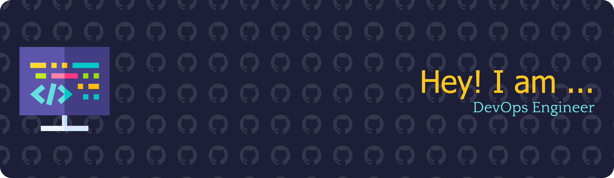

<!--  -->

# Hey, I'm Tammy 🐻

I build systems and software that are precise, elegant, and understandable.

🧠 **DevOps Engineer | Python Developer | AI Practitioner**  
I explore the intersections of automation, infrastructure, and intelligence — always with an eye toward correctness and design.

---

### 🔬 Current Labs
- ⚡ **ML-Automation** — simplifying machine learning workflows to near single-line commands; building elegant abstractions that turn complex pipelines into clean, composable tools
- 🌀 **decorator-lab** — dissecting Python's decorator model and metaprogramming  
- 📊 **Datacraft** — a collection of clean, reusable libraries for data exploration  
- 🧩 **InContext** — experiments in contextual behavior and execution in Python  
- ⚙️ **parallel-universe** — hands-on exploration of concurrency, parallelism, and async models  
- 🔐 **pylocksmith** — investigating Python's security libraries and cryptographic patterns

---

### 🧰 What drives me
- Building tools that balance clarity with power  
- Using AI to accelerate development and insight  
- Architecting systems that are self-documenting and maintainable  
- Treating software like craftsmanship — precise, intentional, and evolving

---

💬 *"Good code is clear thought made visible."*
